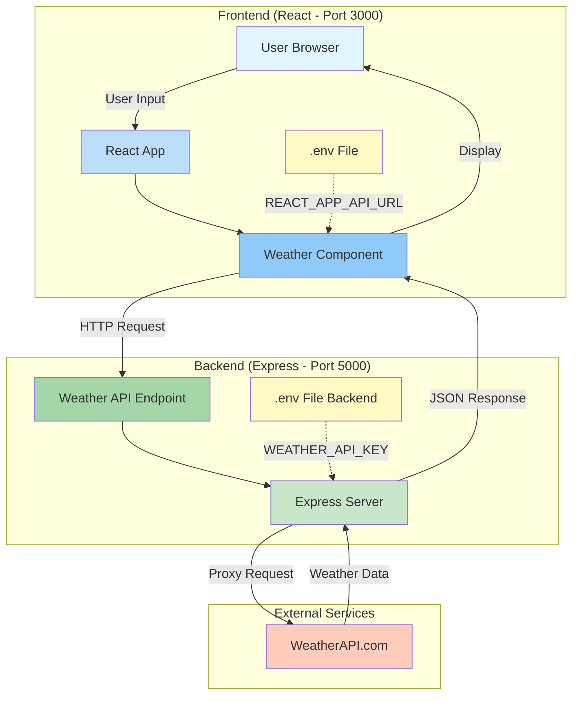

# Weather App Architecture

## System Architecture Diagram



## Data Flow

### 1. User Request Flow
```
User enters city name
    ↓
React Component (weather.js)
    ↓
Reads REACT_APP_API_URL from .env
    ↓
Makes HTTP GET request to backend
    ↓
Backend receives request at /api/weather?city={name}
```

### 2. Backend Processing Flow
```
Express Server receives request
    ↓
Validates city parameter
    ↓
Reads WEATHER_API_KEY from .env
    ↓
Makes request to WeatherAPI.com
    ↓
Receives weather data
    ↓
Returns JSON response to frontend
```

### 3. Response Display Flow
```
Frontend receives weather data
    ↓
Updates React state
    ↓
Renders weather information
    ↓
Displays to user
```

## File Structure with Responsibilities

```
Weather-App/
│
├── frontend/                           # Client-Side Application
│   ├── src/
│   │   └── components/
│   │       └── weather.js              # Makes API calls to backend
│   │                                   # Displays weather data
│   │                                   # Handles user input
│   │
│   └── .env                            # Contains: REACT_APP_API_URL
│                                       # Purpose: Backend endpoint configuration
│
└── backend/                            # Server-Side Application
    ├── server.js                       # Express server setup
    │                                   # CORS configuration
    │                                   # API endpoint definitions
    │                                   # Weather API proxy logic
    │
    └── .env                            # Contains: WEATHER_API_KEY, PORT
                                        # Purpose: API credentials & server config
```

## Security Model

### Before Restructure ❌
```
Frontend (weather.js)
    ↓
    API_KEY hardcoded in source code
    ↓
    Direct call to WeatherAPI.com
    
⚠️ Problem: API key exposed in browser
⚠️ Risk: Anyone can steal the key from source code
```

### After Restructure ✅
```
Frontend (weather.js)
    ↓
    No API key (only backend URL)
    ↓
    Calls backend server
    ↓
Backend (server.js)
    ↓
    API_KEY stored in .env (server-side only)
    ↓
    Proxies request to WeatherAPI.com
    
✅ Benefit: API key never leaves the server
✅ Benefit: .env files not committed to git
✅ Benefit: Easy to change keys without code changes
```

## Environment Variables Strategy

### Development
```
Frontend .env:
REACT_APP_API_URL=http://localhost:5000

Backend .env:
PORT=5000
WEATHER_API_KEY=dev_api_key_here
```

### Production
```
Frontend .env:
REACT_APP_API_URL=https://api.yourapp.com

Backend .env (set in hosting platform):
PORT=5000
WEATHER_API_KEY=prod_api_key_here
```

## API Endpoints Reference

| Endpoint | Method | Request | Response |
|----------|--------|---------|----------|
| `/` | GET | None | API info |
| `/api/health` | GET | None | Health status |
| `/api/weather` | GET | `?city=London` | Weather data |

## Technology Stack

### Frontend
- **React 18** - UI framework
- **Material-UI** - Component library
- **Axios** - HTTP client
- **React Animated Weather** - Weather icons

### Backend
- **Node.js** - Runtime environment
- **Express** - Web framework
- **CORS** - Cross-origin resource sharing
- **dotenv** - Environment variable management
- **Axios** - HTTP client for API calls

### External
- **WeatherAPI.com** - Weather data provider
